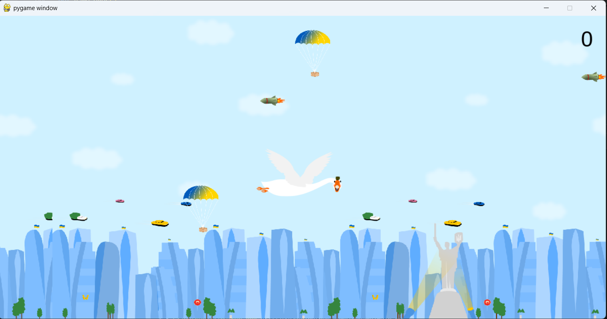

# Game Goose by pygame

This is a simple game written in Pygame.

# 🚀 Game Features
Dynamic Gameplay: Navigate your rocket through various obstacles and enemies.
High Score Tracking: Compete with yourself to beat your high score.


## How to run

1. Clone this repository:
   ```bash
   git clone https://github.com/Czinaaz/pygame.git

2. pip install pygame

3. python main.py

# 🎮 How to Play
Start the Game: Click the Start button on the main menu.
Control the Rocket: Use your keyboard to move your rocket around the screen.
Arrow keys to navigate
Avoid Obstacles: Dodge incoming obstacles and enemies to stay alive.
Collect Bonuses: Grab power-ups to boost your performance.
Goal: Survive as long as you can while scoring points.

### Summary
- GitHub Pages does not directly support Pygame.
- To make your game available online, rewrite it in JavaScript (e.g. Phaser) or use Pyodide to run Python in your browser.
- Alternatively, share the game code on GitHub so others can download and run it locally.
- Visin my repo: https://github.com/Czinaaz/ace-pilot-rocket-run to play another my game!

If you have more questions, let me know! 😊




# Enjoy the game! 
